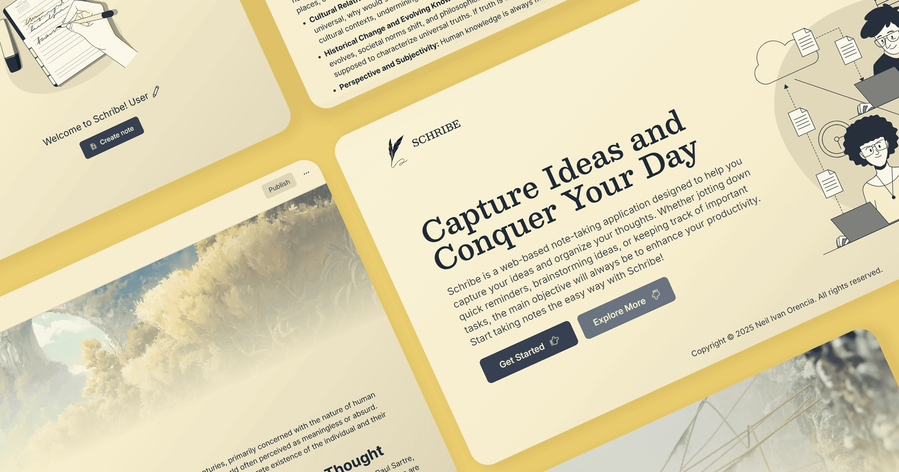

<!-- markdownlint-disable MD033 -->
<!-- markdownlint-disable MD041 -->

  
  <h1 align="center">Schribe</h1>
  
Capture Ideas and Conquer Your Day

   
  
    
  

    
    
    
    
    
    
  

 

Schribe is a minimalistic note-taking web application for capturing and organizing thoughts. It offers features such as nested documents, cover images, and public sharing capabilities. It incorporates modern, user-friendly text editing through a Blocknotes-powered slash menu to provide multiple text formatting options. It also uses Convex, which is a real-time database in order to ensure immediate data synchronization across connected clients, reflecting note updates instantaneously.

## Features

- **Dual Theme System** -  Offers a dual theme system to accommodate user preferences and viewing environments.  A cornsilk light theme provides a bright, aesthetically-looking interface suitable for well-lit conditions, while an indigo dark theme reduces eye strain in low-light settings.

  
See screenshot
 

- **Block-Based Content Architecture** - Powered by Blocknotes, the web application employs a block-based architecture that structures content into independent modules. This design allows for granular content manipulation to enable users to rearrange paragraphs, headings, and media.  Editing and formatting blocks individually ensures an efficient workflow and maintains the structural integrity of the document throughout the writing process.

  
See screenshot
 

- **Text Formatting Palette** - Provides a comprehensive suite of text formatting options to enrich note composition. Users can structure content with three distinct heading levels, create organized lists using numbered and bulleted formats, manage tasks with checklists, and compose paragraphs.  The inclusion of image embedding and emoji support further enhances expressive and visually engaging note-taking.

  
See screenshot
 

- **Hierarchical Document Nesting** -  To facilitate advanced organization, the web application supports nested documents. This feature enables users to establish hierarchical relationships between notes, categorizing topics and subtopics effectively.  Nested documents contribute to a more structured and easily navigable knowledge base, particularly beneficial for extensive note collections.

  
See screenshot
 

- **Archive Note Management** - Incorporates an archive functionality to provide a safeguard for note deletion. Upon initial deletion, notes are moved to a trash archive, granting users a recovery period to reinstate notes if needed. This two-step deletion process offers an added layer of data protection to allow users to permanently remove notes from the archive at their discretion.

  
See screenshot
 

- **Public Note Dissemination via Links** - Enables users to share notes publicly through shareable links. This allows for easy distribution of information to make notes accessible to a wider audience without requiring recipients to have an account.

  
See screenshot
 

## Technology Stack

- **Clerk** - An authentication platform offering social, passwordless, and multi-factor login options, basic user management and more.
- **Next.js** - A powerful React framework used for building fast and optimized web applications.
- **React** - A JavaScript library made by Facebook primarily used for building user interfaces for web applications.
- **shadcn/ui** - A UI component library specifically designed for building user interfaces in web applications using React.
- **Tailwind CSS** - A utility-first CSS framework that allows for quick and flexible styling using predefined classes.
- **Typescript** - A strongly typed programming language that builds on JavaScript by adding static types.
